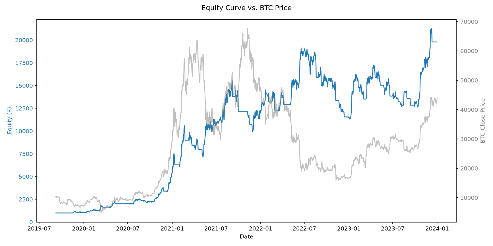

# Summer of Quant — BTC/USD Volume-Spike Strategy

A daily-bar BTC/USD trading strategy and backtesting pipeline built for the
*BTC/USD Trading Strategy Backtesting Challenge* (see `Problem_statement.pdf`).
The strategy enters on volume-spike breakouts, filtered by an SMA trend
filter and an RSI overbought/oversold filter, and manages risk with an
ATR-based trailing stop (supports both long and short positions, with
direct reversals).

> **On the competition's claimed Sharpe 6.32 / 24x result:** the script that
> produced that result (`results_kush.csv`, referenced by the leftover
> `backtester.py` `__main__` block) is not present anywhere in this repo or
> its git history. The only strategy logic that exists is the volume-spike
> breakout below. Rather than presenting unverifiable historical numbers,
> this README reports what this strategy **actually, reproducibly** scores
> on the official training data, run end-to-end by the scripts in this repo.

## Strategy summary

- **Asset / timeframe:** BTC/USD, daily bars (`data/BTC_2019_2023_1d.csv`,
  the official competition training set, 2019-09-08 to 2024-01-01).
- **Entry:** a volume spike (current volume above a rolling 6-bar mean +
  `vol_std_mult` standard deviations) in the direction of the candle
  (bullish candle → long, bearish candle → short), filtered by:
  - **Trend filter:** price above/below an SMA (`sma_length`, default 50).
  - **Momentum filter:** RSI not overbought (long) / not oversold (short).
- **Exit / risk management:** an ATR-based trailing stop
  (`trailing_stop_mult × ATR`), which also drives direct long↔short
  reversals when an opposite-direction spike fires while a position is open.
- **No lookahead bias:** every indicator and signal at bar *i* depends only
  on data up to and including bar *i* — verified by
  `tests/test_signals.py::test_no_lookahead_bias_truncated_prefix_matches_full_run`.

## Repo layout

```
data/        loader.py (CSV schema normalization) + the two provided OHLCV CSVs
strategy/    indicators.py, params.py, signals.py — signal generation logic
backtest/    backtester.py (competition-provided, UNMODIFIED) + runner.py + metrics.py
notebooks/   main.ipynb — EDA / results walkthrough using the same modules as scripts/
scripts/     run_backtest.py, optimise.py, walk_forward.py
results/     metrics.csv, equity_curve.png, monthly_returns_heatmap.png, sweep/walk-forward CSVs
tests/       pytest unit + integration tests
```

`backtest/backtester.py` is the competition-provided framework and is
**never modified** — all additional metrics (Sortino, CAGR, drawdown
duration, monthly heatmap) are computed in `backtest/metrics.py` on top of
its output (the daily equity curve from `BackTester.calc_capital()`).

## Install & run

```bash
python3 -m venv .venv
source .venv/bin/activate
pip install -r requirements.txt

python scripts/run_backtest.py     # full backtest on the training set -> results/
python scripts/optimise.py         # parameter sweep, in-sample/out-of-sample report
python scripts/walk_forward.py     # rolling 6-month-train/1-month-test robustness check
python -m pytest tests/ -v         # unit + integration tests
```

## Backtest results (full training period, 2019-09-08 to 2024-01-01)

| Metric | Default params | Tuned params* |
|---|---|---|
| Sharpe ratio (daily equity, annualized) | 1.64 | **1.73** |
| Sortino ratio | 2.24 | **2.30** |
| Max drawdown | 40.9% | **32.4%** |
| Max drawdown duration | 532 days | **295 days** |
| CAGR | 99.7% | **103.5%** |
| Cumulative return | 1878.7% | **2043.7%** |
| Total trades | 37 | 46 |
| Win rate | 48.6% | 50.0% |
| Avg win / avg loss | $1981 / -$859 | $1525 / -$636 |
| Avg holding period | 28.8 days | 19.4 days |

\* Tuned params: `sma_length=50, vol_std_mult=1.5, trailing_stop_mult=1.5` (vs.
defaults `sma_length=50, vol_std_mult=1.5, trailing_stop_mult=2.0` — the
sweep only changed the trailing-stop multiplier). **Not yet applied as the
default** — see the overfitting caveat below before adopting these.

`backtester.py`'s own (per-trade, non-standard) Sharpe reports 5.43 for the
default run; the 1.64 above is the standard annualized Sharpe computed on
the daily equity curve, which is the number this README treats as
authoritative. Full per-run output, including `backtester.py`'s native
statistics, is in `results/metrics.csv` and printed by
`scripts/run_backtest.py`.

### In-sample vs. out-of-sample (Step 5 parameter sweep)

64 combinations of `sma_length × vol_std_mult × trailing_stop_mult` were
swept on the first 80% of the training data (in-sample), holding out the
last 20% (2023-02-20 to 2024-01-01) as out-of-sample.

| | In-sample | Out-of-sample |
|---|---|---|
| Best combo (by IS Sharpe): sma=50, vol_std=1.5, tsl=1.5 | Sharpe 1.89, CAGR 128.9%, 35 trades | Sharpe 1.11, CAGR 35.5%, 10 trades |

**⚠️ Overfitting signal:** in-sample Sharpe (1.89) is ~1.7x the out-of-sample
Sharpe (1.11), above the 1.5x warning threshold this repo uses. Out-of-sample
performance is still positive and reasonably strong, but the in-sample
number should not be taken at face value.

A more robust (less overfit) alternative surfaced in the same sweep:
**sma=50, vol_std=1.0, trailing_stop_mult=1.5** scored IS Sharpe 1.60 vs.
OOS Sharpe **1.64** (i.e. out-of-sample was *not worse* than in-sample) —
worth considering over the raw best-IS-Sharpe pick if consistency matters
more than the single best in-sample number. Full grid in
`results/param_sweep.csv`.

No parameters have been changed in `strategy/params.py` — confirm which
combination (if any) to adopt before that file is edited.

### Walk-forward validation (Step 6)

Rolling 6-month-train / 1-month-test windows, evaluated on the continuous
full-period equity curve (not re-run per window, to avoid truncating
in-flight trades — this strategy's average holding period, ~20-29 days, is
close to the 1-month window length itself).

| | Default params | Tuned params (tsl=1.5) |
|---|---|---|
| Mean window Sharpe | 1.15 | 1.16 |
| Std dev of window Sharpe | 3.99 | 4.01 |
| % windows with positive return | 51.1% | **62.2%** |
| Chained growth across all windows | 1236.5% | **1437.9%** |

Full per-window breakdown: `results/walk_forward.csv`, distribution plots:
`results/walk_forward_distribution.png`. The tuned trailing-stop multiplier
improves both the in-sample sweep numbers and the walk-forward consistency,
which is a reasonable case for adopting it — but per the overfitting signal
above, treat it as a candidate, not a settled choice.

### Plots



Monthly returns heatmap: `results/monthly_returns_heatmap.png`. Interactive
Plotly trade/PnL graphs (from the unmodified `backtester.py`) are generated
in `notebooks/main.ipynb`.

## Known limitations (carried over from the original audit)

- The official competition **test set is not in this repo** — only the
  training set (`BTC_2019_2023_1d.csv`) is available, so "out-of-sample"
  above means a held-out slice of the training data, not the actual grading
  set. Don't read these numbers as a competition-score prediction.
- `backtester.py` fills entries/exits at the **same candle's close** that
  generated the signal, not "open of next candle" as the problem statement
  describes — this is baked into the provided, unmodified framework and
  applies identically to every strategy run through it.
- `data/btc_2014_2019_1d.csv` (2014-2019) is earlier BTC history with a
  different schema; it's normalized by the same loader but not used in any
  of the reported results above, since it isn't part of the competition's
  official training/test data.
